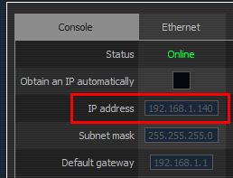
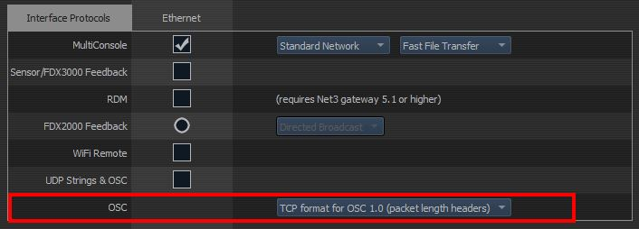
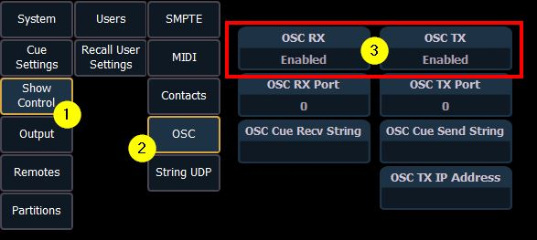
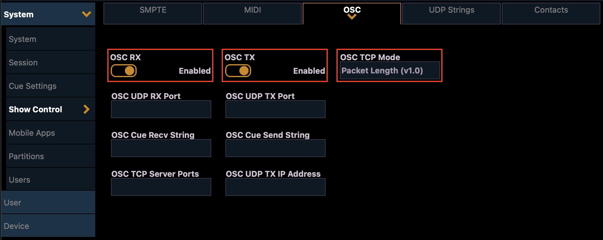

# ETC Eos Module

## Configure your console

### EOS v3.1.x and earlier

Exit out of your console and enter the Eos Shell (Eos Configuration Utility).

Open **Settings** and click on **Network**. Make a note of your console's IP address.



Scroll down to the **Interface Protocols** section and make sure the OSC TCP Format is **TCP format for OSC 1.0 (packet length headers)** (the default option). Save your changes by pressing the **Accept** button, then launch your console.



Once your console has started, make sure the **OSC RX** and **OSC TX** options are enabled (they are by default). The location may vary depending on your console's version, but it should be somewhere close to **Setup > System > Show Control > OSC**.



_Previous versions of this module asked you to change the OSC [UDP] RX Port. This is no longer required. You should reset the field back to `0` if you're not using it for another purpose._

### EOS v3.2.x and later

You will find the network settings now in Setup > Device Settings > Network


If you use the EOS software local on a Mac/PC with Streamdeck+ attached you no longer need an active network connection as long as the OS recognize a network card (WIFI or Ethernet). You can use the loopback address 127.0.0.1 instead.

You will find the OSC settings in Setup > System Settings > Show Control > OSC



## Configure Companion

Add and configure the module in Companion.

The **Target IP** will be the IP address of your Eos console.

The **User ID** field lets you choose which user these commands should be executed under on your console. This user must first be setup on your console or your actions won't work. The default user in this module (and on your console) is User ID 1.

You should use a different **User ID** if someone will be running your console while it's being controlled through Companion (especially if you use the **Custom Command** action) otherwise your actions and command lines may conflict with each other.

_A User ID of `-1` refers to whichever user the console is currently set to._

The **Use TCP SLIP** setting will use port 3037 with TCP 1.1 SLIP protocol, otherwise it will use port 3032. This is a new option since EOS 3.1 for 3rd party connections.

## Actions

While it's not practical to create specific actions for every possible command available in your light console, some common actions/keys have been added, although the **Custom Command** action is the most flexible.

| Action                         | Description                                                                                                                                                                                                                                                                                                                        |
| ------------------------------ | ---------------------------------------------------------------------------------------------------------------------------------------------------------------------------------------------------------------------------------------------------------------------------------------------------------------------------------- |
| Custom Command                 | Runs a custom command. See the section below for more information.                                                                                                                                                                                                                                                                 |
| Custom Command (OSC)           | Sends a custom OSC command to Eos. See the **Supported OSC Input** section in the [Eos Operations Manual](https://www.etcconnect.com/WebDocs/Controls/EosFamilyOnlineHelp/en-us/Default.htm) for a list of commands. The paths should all start with `/eos/`. Use the Generic OSC module for more advanced OSC use.                |
| Custom Command (OSC) with args | Sends a custom OSC command to Eos with arguments. See the **Supported OSC Input** section in the [Eos Operations Manual](https://www.etcconnect.com/WebDocs/Controls/EosFamilyOnlineHelp/en-us/Default.htm) for a list of commands. The paths should all start with `/eos/`. Use the Generic OSC module for more advanced OSC use. |
| Key: Blackout                  | Toggles the **Blackout** button.                                                                                                                                                                                                                                                                                                   |
| Key: Go                        | Runs the next cue in the current list.<br />This is the same as pressing the **Go** button on your console.                                                                                                                                                                                                                        |
| Key: Stop/Back                 | Press once to stop the current cue (if it's running), and again to move back to the previous cue in the list.<br />This is the same as pressing the **Stop/Back** button on your console.                                                                                                                                          |
| Run Cue                        | Runs a specific cue in a cue list.                                                                                                                                                                                                                                                                                                 |
| Run Macro                      | Runs a specific macro.                                                                                                                                                                                                                                                                                                             |
| Press Key                      | Presses one of the console's keys. A full list of keys can be found in the latest [Eos Family Operations Manual](https://www.etcconnect.com/WorkArea/DownloadAsset.aspx?id=10737500523) (links to v2.9.1); do a search for `Eos OSC Keys` (use the value from the first column).                                                   |
| Channel Intensity              | Sets a channel's intensity to a percentage, or to a keyword: `out`, `full`, `min`, `max`.                                                                                                                                                                                                                                          |
| Group Intensity                | Sets a group's intensity to a percentage, or to a keyword: `out`, `full`, `min`, `max`.                                                                                                                                                                                                                                            |
| Submaster Intensity            | Sets a submaster's intensity to a percentage, or to a keyword: `out`, `full`, `min`, `max`.                                                                                                                                                                                                                                        |
| Submaster Bump                 | Simulates a submaster's bump button. The **State** property can be:<br /> - Press and Release<br /> - Press and Hold<br /> - Release<br /><br />_Hint: Add this action to a down/on action to **Press and Hold**, and a **Release** action to up/off, then make the button **Latch/Toggle**._                                      |
| Fire Preset                    | Runs the preset given its number.                                                                                                                                                                                                                                                                                                  |

## Dynamic variables

Dynamic variables are available to use in button's text and provide realtime information about your console.

For example, a button with this text `Live Cue:\n$(etc-eos:cue_active_num) - $(etc-eos:cue_active_label)` would show the active cue number and that cue's label.

Note: `\n` is used to put a new line in the button's text. It's unrelated to using a dynamic variable.

A list of the available variables is listed on the module's config page, and is also available below:

| Variable                        | Description                         | Example value               |
| ------------------------------- | ----------------------------------- | --------------------------- |
| $(etc-eos:cue_active_list)      | The active cue list number          | 1                           |
| $(etc-eos:cue_active_num)       | The active cue number               | 30                          |
| $(etc-eos:cue_active_label)     | The active cue label                | Intermission                |
| $(etc-eos:cue_active_duration)  | The active cue duration in seconds  | 3.0                         |
| $(etc-eos:cue_active_intensity) | The active cue intensity percent    | 100%                        |
| $(etc-eos:cue_pending_list)     | The pending cue list number         | 1                           |
| $(etc-eos:cue_pending_num)      | The pending cue number              | 40                          |
| $(etc-eos:cue_pending_label)    | The pending cue label               | Act 3                       |
| $(etc-eos:cue_pending_duration) | The pending cue duration in seconds | 3.0                         |
| $(etc-eos:show_name)            | The name of the show                | My show                     |
| $(etc-eos:cmd)                  | The command line for the user       | LIVE: Cue 20 : Sub 1 @ 60 # |
| $(etc-eos:softkey_label_1)      | Soft key 1's label                  | Attributes                  |
| $(etc-eos:softkey_label_2)      | Soft key 2's label                  | Fw/Hg                       |
| $(etc-eos:softkey_label_3)      | Soft key 3's label                  | AutoMark Off                |
| $(etc-eos:softkey_label_4)      | Soft key 4's label                  | Link/Loop                   |
| $(etc-eos:softkey_label_5)      | Soft key 5's label                  | Execute                     |
| $(etc-eos:softkey_label_6)      | Soft key 6's label                  |                             |
| $(etc-eos:softkey_label_7)      | Soft key 7's label                  |                             |
| $(etc-eos:softkey_label_8)      | Soft key 8's label                  |                             |
| $(etc-eos:softkey_label_9)      | Soft key 9's label                  |                             |
| $(etc-eos:softkey_label_10)     | Soft key 10's label                 |                             |
| $(etc-eos:softkey_label_11)     | Soft key 11's label                 | Offset                      |
| $(etc-eos:softkey_label_12)     | Soft key 12's label                 | AutoBlk Clean               |

_Soft keys 7-12 are the alternates available when you toggle the {More SK} button._

## Wheels - Distinct Parameters

These parameters are reported when working with a fixture. You must select the fixture by typing its number on the command line. If using next/last or other methods the EOS software does not consistently send updates on the values.

All of these variables are availabe in a string (integer) and a floating point format. Just append _stringval or _floatval to the end of the base name in the list below:

```
enc_intensity
enc_background_intensity
enc_zoom
enc_edge
enc_iris
enc_pan
enc_tilt
enc_x_focus
enc_y_focus
enc_z_focus
enc_red
enc_green
enc_blue
enc_red_main
enc_green_main
enc_blue_main
enc_white_main
enc_bgnd_red
enc_bgnd_grn
enc_bgnd_blu
enc_bgnd_whi
enc_white
enc_cyan
enc_magenta
enc_yellow
enc_amber
enc_lime
enc_indigo
enc_uv
enc_red_adj
enc_green_adj
enc_blue_adj
enc_white_adj
enc_cyan_adj
enc_magenta_adj
enc_yellow_adj
enc_amber_adj
enc_lime_adj
enc_indigo_adj
enc_hue
enc_cto
enc_ctb
enc_color_select
enc_color_mix_mspeed
enc_ctc
enc_shutter_strobe
enc_saturation
enc_diffusion
enc_diffusion_2
enc_edge_distance
enc_position_mspeed
enc_position_blink
enc_color_mix
enc_color_mix_2
enc_background_color_mix
enc_cmixmaft
enc_cmixmart
enc_color_temperature
enc_cri
enc_angle_a
enc_angle_b
enc_angle_c
enc_angle_d
enc_thrust_a
enc_thrust_b
enc_thrust_c
enc_thrust_d
enc_frame_assembly
enc_gobo_select
enc_gobo_ind_spd
enc_gobo_select_2
enc_gobo_ind_spd_2
enc_gobo_select_3
enc_gobo_ind_spd_3
enc_beam_fx_select
enc_beam_fx_ind_spd
enc_beam_fx_select_2
enc_beam_fx_ind_spd_2
enc_animation_select
enc_animation_ind_spd
enc_cooling_fan
enc_dim_curve
enc_global_mspeed
enc_lt_diffusion
enc_med_diffusion
enc_color_mix_mode
enc_edge_mode
enc_edge_adjust
enc_effect_macros
enc_form_mspeed
enc_tint
enc_color_temperature
enc_color_mix_mode_2
enc_color_crossfade
enc_cie_x
enc_cie_y
enc_cie_x_2
enc_cie_y_2
enc_cie_x_3
enc_cie_y_3
enc_cie_x_4
enc_cie_y_4
enc_cie_x_5
enc_cie_y_5
enc_cie_x_6
enc_cie_y_6
enc_cie_x_7
enc_cie_y_7
enc_cie_x_8
enc_cie_y_8
```

## Wheels - By category

The encoder wheels are also availble by category:

| Category# | Description         |
| --------- | ------------------- |
| 0         | Uncategorized       |
| 1         | Intensity           |
| 2         | Focus               |
| 3         | Color               |
| 4         | Image               |
| 5         | Form                |
| 6         | Shutter             |

Each category will have its own set of encoder wheels depending on
the fixture selected

| Variable                     | Description                            |
| ---------------------------- | -------------------------------------- |
| catX_wheel_count             | How many wheels are in this category   |
| catX_wheel_Y_label           | Label for Wheel Y of Category X        |
| catX_wheel_Y_stringval       | String/Int for Wheel Y of Category X   |
| catX_wheel_Y_floatval        | Float value for Wheel Y or Category X  |
| catX_wheel_Y_oscname         | OSC path value (from label)            |

There is a sample Stream Deck + configuration file in the github repository that demonstrates how this can be used effectively to manage all encoders on a single Stream Deck + page.

## Group labels

To allow the use of buttons to select groups, and capture the group label for use on the buttons, there are a set of variables that hold this information.

Currently the first 30 groups are captured:

group_label_1 through group_label_30


## Feedbacks

Feedbacks let a button's style change when something happens. There are three feedbacks available:

| Feedback                           | Description                                                                                                                                              |
| ---------------------------------- | -------------------------------------------------------------------------------------------------------------------------------------------------------- |
| When cue is pending                | Changes the button's foreground and background color when the cue that's pending on the console matches the one entered in the `Cue List/Number` fields. |
| When cue is active                 | Changes the button's foreground and background color when the cue that's active the console matches the one entered in the `Cue List/Number` fields.     |
| When connection to console changes | Changes the button's foreground and background color when Companion's connection to the Eos console changes (connected or disconnected).                 |

_Note: ETC Element consoles only have a single cue list: `1`._

## Presets

Presets help you quickly configure new buttons. There are several presets available:

| Category | Name                       | Description                                                                                                                                        |
| -------- | -------------------------- | -------------------------------------------------------------------------------------------------------------------------------------------------- |
| Cues     | Cue #                      | Runs the cue number. Adds feedback to show whether this cue is active or is pending. _Don't forget to change the cue number in the feedbacks too!_ |
| Cues     | Go [CUE] [INTENSITY%]      | The same as the "Go" button on your console. Also shows the pending cue number and the cue's intensity as the button's text.                       |
| Cues     | Stop/Back                  | The same as the "Stop/Back" button on your console.                                                                                                |
| Status   | [CURRENT CUE NUMBER/LABEL] | _No action when pressed._ Shows the number and label of the current cue.                                                                           |
| Status   | [SHOW NAME]                | _No action when pressed._ Shows the name of the loaded show.                                                                                       |
| Status   | [COMMAND LINE]             | _No action when pressed._ Shows the command line for the user (set in the module's config).                                                        |

### Custom command

This can be used to run complex commands that aren't possible to create using the above actions.

Each custom command has three properties:

- **Before**:
  - **Clear command line** of anything that may already be on it.
  - **Keep command line** and append this command to it.
- **Command**: The command to run.
- **After**:
  - **Add to command line** but don't run the command.
  - **Run this command**.

You can use these properties to create actions on different buttons and piece together complete commands from different button presses.

#### Examples

| Command                       | Eos Result                                        |
| ----------------------------- | ------------------------------------------------- |
| `Go_to_cue 5`                 | Triggers cue 5 with its timing.                   |
| `Chan 12 thru 16 at 100`      | Sets intensity of channels 12-16 to 100%.         |
| `Chan 4 sneak 5`              | Sneaks channel 4 over 5 seconds.                  |
| `Chan 4 sneak 1:30`           | Sneaks channel 4 over 1 minute 30 seconds.        |
| `Chan 1.1 thru 1.12 at 50`    | Sets Channel 1 Cell 1 thru Chan 1 Cell 12 to 50%. |
| `Group 1 at out`              | Group 1 intensity to 0%.                          |
| `Chan 80 thru 100 Effect 150` | Runs effect 150 on channels 80-100.               |
| `Chan 80 thru 100 Effect`     | Stops effects on channels 80-100.                 |
